<!-- Global style -->

<!-- footer:  Link para esta apresentação: [https://tmedicci.github.io/workshop-meshtastic-lhc/](https://tmedicci.github.io/workshop-meshtastic-lhc/) -->

# Meshtastic Install Fest

**Rede de Comunicação LoRa mesh
aberta, livre e de baixo custo!**

---

## LHC? :thinking:

O Laboratório Hacker de Campinas é *"hackerspace de Campinas que fornece um espaço aberto e comunitário para que entusiastas de tecnologia possam desenvolver seus projetos em áreas como eletrônica, robótica, mecânica, computação, jogos, culinária, artes, ou o que mais a criatividade e o espaço físico disponível permitirem."* (de [lhc.net.br](https://lhc.net.br))

---

### Workshop no LHC?

Este workshop é uma iniciativa minha - Tiago (membro do LHC desde 2018) - com o apoio de colegas. E, claro, é totalmente gratuito!

Gostou e quer ajudar de alguma forma? Faça uma doação ao LHC (pix para batman@lhc.net.br) e considere tornar-se um associado!

---

## O que é o Meshtastic?

*Da definição do próprio site do Meshtastic* :innocent:

O Meshtastic é projeto que possibilita o uso de rádios LoRa de baixo custo como uma plataforma de comunicação off-grid de longo alcance para áreas sem infraestrutura de comunicação existentes ou confiáveis. Este projeto é 100% desenvolvido pela comunidade e aberto!

---

### Topologia da Rede :globe_with_meridians:

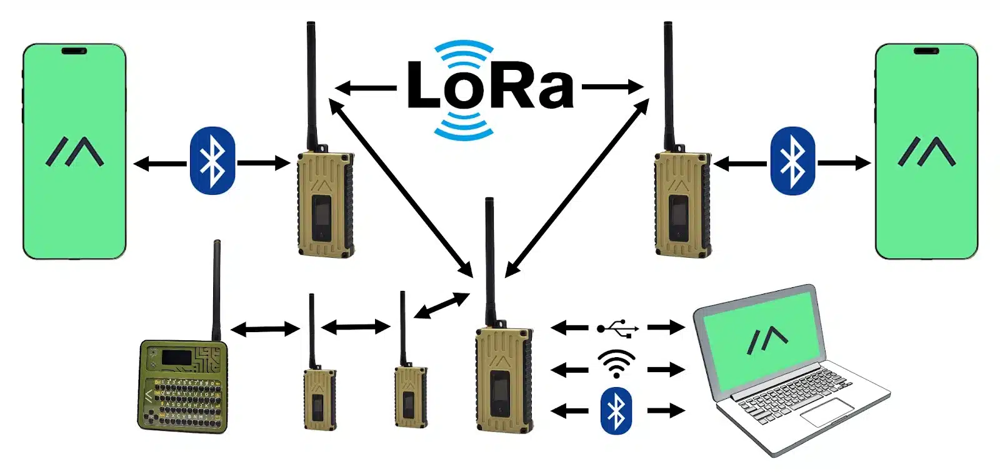

---

### Mas para Quê?

- Longo Alcance ([331km record by MartinR7 & alleg](https://meshtastic.org/docs/overview/range-tests/#current-ground-record-331km))
- Comunicação off-grid ("substitui" operadoras de telefonia)
- Comunicação descentralizada - não requer um roteador dedicado
- Comunicação criptografada
- Baixo consumo de bateria
- Enviar e Receber mensagens de texto entre os membros da rede Mesh
- Localização (opcional) baseada em GPS
- E muito mais...

---

### Como Participar? :loudspeaker:

Adquira seu rádio (por volta de ~R$200,00) e comece a usar!

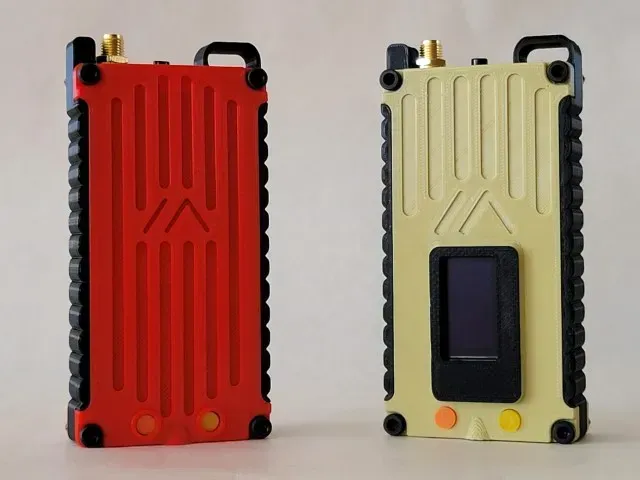

---

#### Sugestões de Placas para o Meshtastic

##### LILYGO® TTGO T-Beam

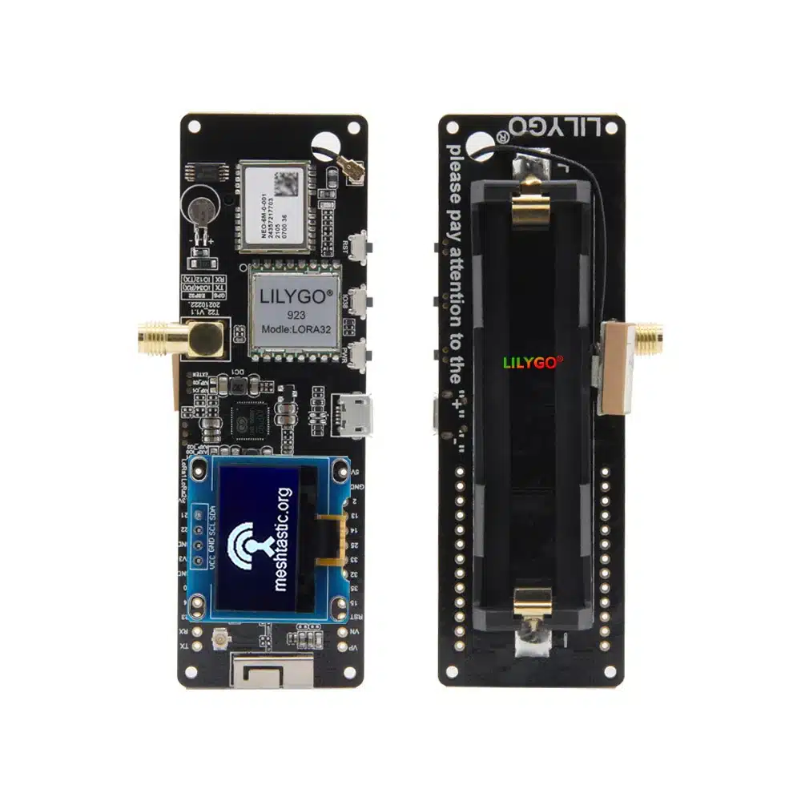

Esta placa é a opção mais adequada para quem quer ter um rádio portátil, pois contém espaço para uma pilha recarregável e contém um módulo de GPS integrado na placa. Ela utiliza o ESP32 como microcontrolador e um rádio LoRa SX1276.

---

#### Sugestões de Placas para o Meshtastic

##### LILYGO® TTGO T-Beam

O preço médio desta placa é em torno de R$200,00 (quando este artigo foi escrito, em dezembro de 2024) para a primeira compra no Aliexpress.

---

#### Sugestões de Placas para o Meshtastic

##### HELTEC® LoRa 32 v3

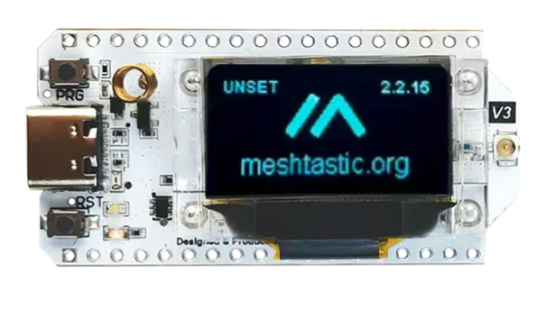

Esta placa é bastante similar à T-Beam. Ela utiliza, no entanto, o ESP32-S3 (mais potente do que o ESP32) e  um rádio LoRa SX1262, além de contar com um slot para encaixar uma bateria de lítio.

---

#### Sugestões de Placas para o Meshtastic

##### HELTEC® LoRa 32 v3

Esta placa, porém, não possui GPS integrado e, portanto, é mais adequada para nós estacionários (nada impede, porém, que seja usada como rádio portátil já que a posição pode ser lida pelo GPS de seu smartphone ao utilizar o aplicativo Meshtastic).

---

#### Sugestões de Placas para o Meshtastic

##### HELTEC® LoRa 32 v3

Preço médio de R$180,00 (outubro de 2024) no Aliexpress e Mercado Livre;

---

### Mas é Legal? :open_book:

Sim, o LoRa opera na faixa ISM (*industrial, scientific, and medical*) que, no Brasil, compreende de 902MHz a 928MHz.

Em específico, o Brasil usa o mesmo plano de frequências da Austrália/Nova Zelândia (de 915MHz a 928MHz), conhecido como **AU915**

As legislações relacionadas são:
- [Resolução nº 680, de 27 de junho de 2017](https://informacoes.anatel.gov.br/legislacao/resolucoes/2017/936-resolucao-680)
- [Ato nº 14448, de 04 de dezembro de 2017](https://informacoes.anatel.gov.br/legislacao/atos-de-certificacao-de-produtos/2017/1139-ato-14448)

---

## Getting Started :toolbox:

Ok, vamos lá:

A gravação do firmware Meshtastic na placa é feita através do site [https://flasher.meshtastic.org/](https://flasher.meshtastic.org/)

---

## Getting Started :toolbox:

### Mas antes...

(No Windows) É necessário instalar o driver para o computador identificar a placa:

- Baixe e instale o driver de [https://www.silabs.com/developers/usb-to-uart-bridge-vcp-drivers?tab=downloads](https://www.silabs.com/developers/usb-to-uart-bridge-vcp-drivers?tab=downloads)

---

### Gravando a Placa

1. Acesse [https://flasher.meshtastic.org/](https://flasher.meshtastic.org/)

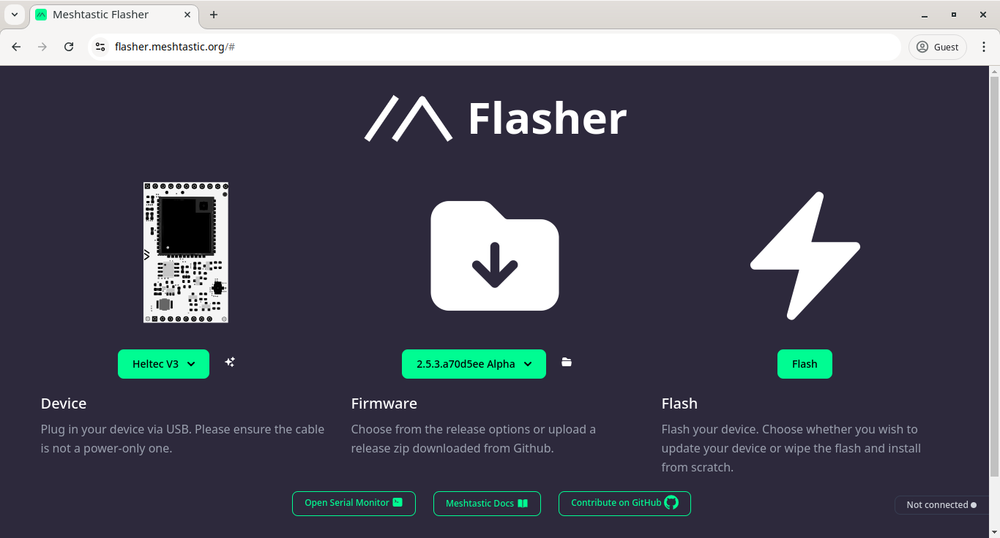

---

### Gravando a Placa

2. Selecione “Heltec V3” (ou qualquer outra placa que deseja gravar) em *Device*;
3. Selecione a versão do firmware do Meshtastic. Recomendo utilizar a última versão disponível (atualmente, alguma versão baseada na versão 2.5)
4. Clique em *“Flash*”;

---

### Gravando a Placa

5. Após clicar em *“Flash*”, a tela seguinte exibirá a versão selecionada e, ao final da página (provavelmente será necessário rolar a página), clique em *“Continue*:

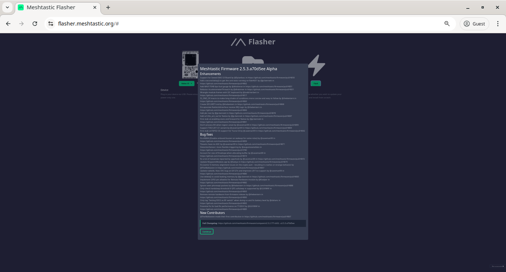

---

### Gravando a Placa

6. Selecione a velocidade de gravação em “*Choose baud rate*”. Selecione *921600* (a velocidade máxima). Marque também a opção “*Full Erase and Install*“ para que todo o firmware seja sobrescrito:

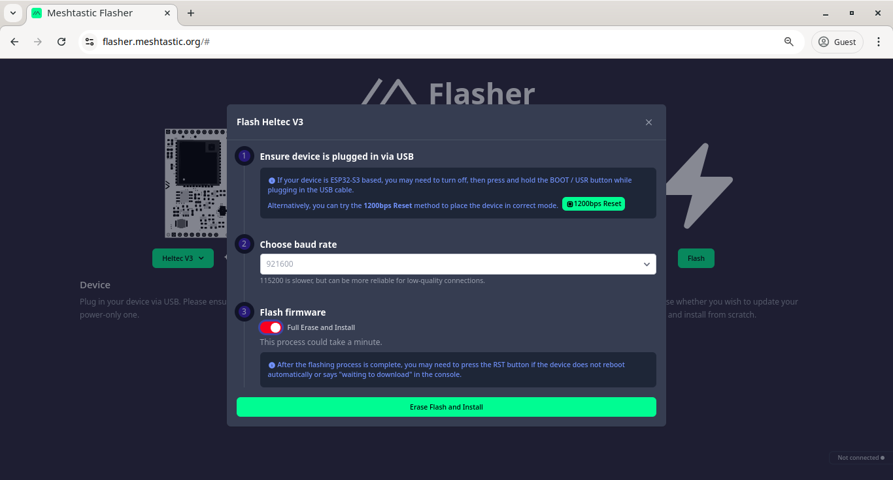

7. Finalmente, clique em “*Erase Flash and Install*” e aguarde a finalização da gravação.

---

### Configurando o Meshtastic :gear:

Após a primeira inicialização é necessário configurar o seu dispositivo para que ele funcione corretamente no Brasil. A forma mais eficaz de fazer isso é através do aplicativo Meshtastic para iOS e Android.

#### Ué, mas então precisa do Smartphone para o Meshtastic funcionar? :confused:

Calma! O seu smartphone atua somente como uma interface homem-máquina, ou seja, como um meio de configurar e interagir com seu dispositivo LoRa. Isso é feito através de uma conexão via Bluetooth ou Wi-Fi, mas o dispositivo (e seu Smartphone) não precisa de uma conexão com a internet.

---

#### Conectando-se ao nó por Bluetooth

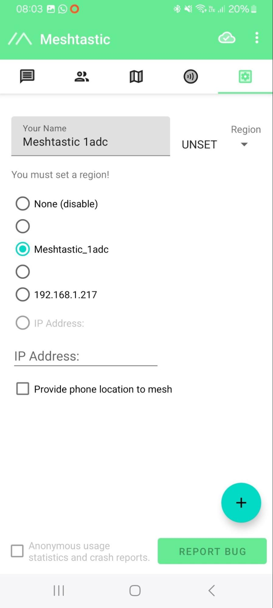

- Clique no botão com o formato de :heavy_plus_sign: no canto inferior direito e selecione o seu dispositivo no Smartphone (nesta etapa, recomendamos que outros possíveis nós sejam desligados para que somente um nó seja identificado e configurado).

---

#### Conectando-se ao nó por Bluetooth

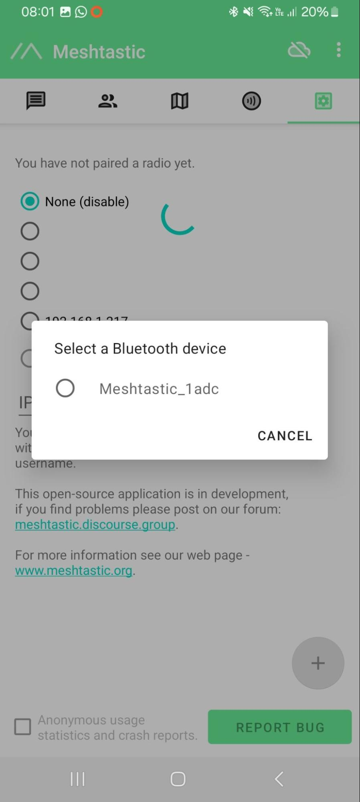
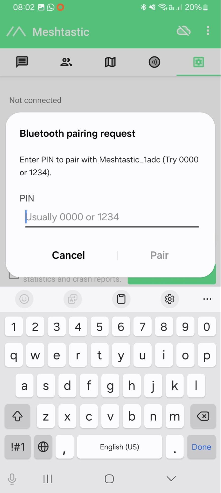

- O PIN será mostrado na tela da placa caso o dispositivo tenha uma tela. Caso contrário, a senha será *123456*.

---

#### Selecionando a Região LoRa

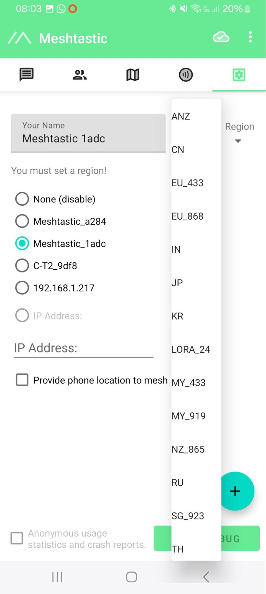

O Brasil usa a mesma especificação que a Austrália e Nova Zelândia para o LoRa. Assim, selecione a região `ANZ` e aguarde o dispositivo reiniciar e o aplicativo voltar a conectar-se a ele.

---

#### Acessando as Configurações do Nó/Rádio LoRa

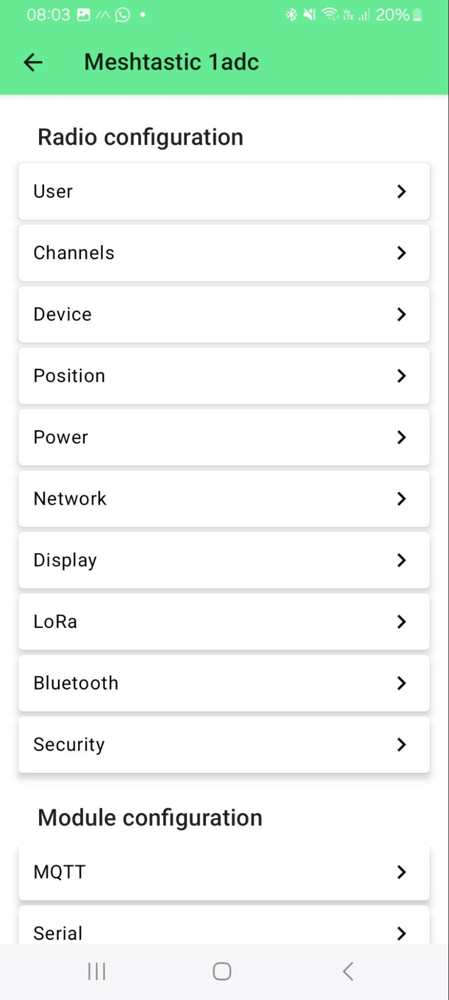

Clique no ícone com 3 pontos (alinhados na vertical), no canto superior direito, para acessar as configurações do Nó. Em *User*, é possível alterar o nome do dispositivo.

---

#### Configuração dos Canais

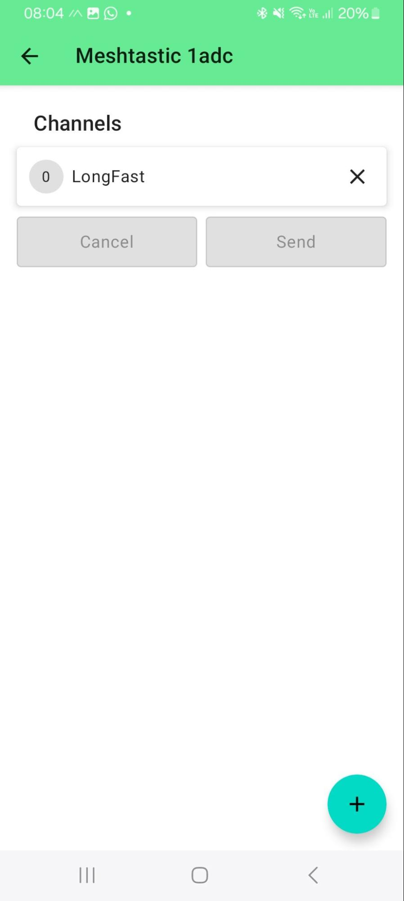
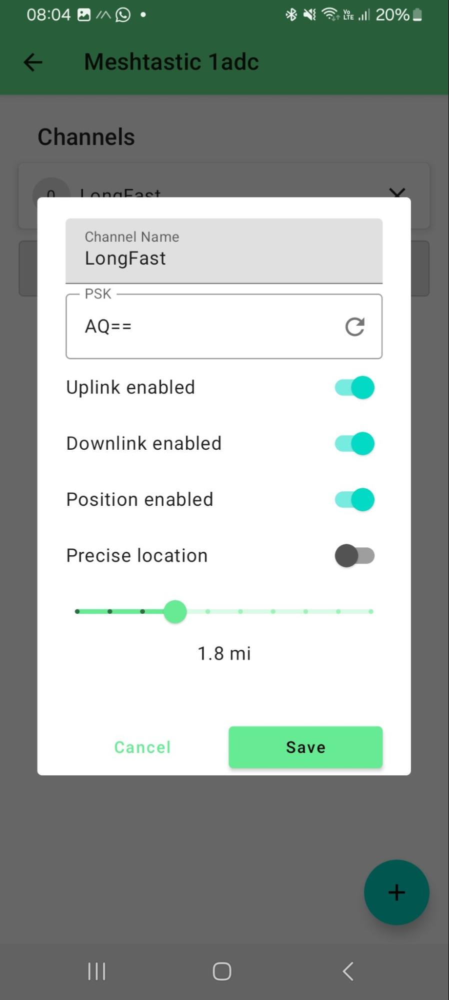

Clique no único canal configurado (*0 - Long Fast*) para configurá-lo. *Uplink/Downlink Enabled* permite encaminhar mensagens via servidor MQTT*

---

#### Configuração do Dispositivo

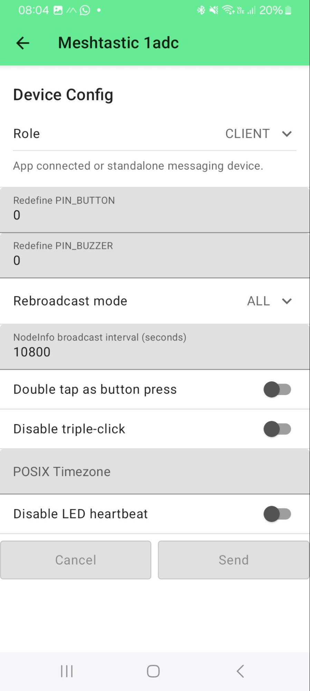

Certifique-se que, em *Role*, está selecionada a opção *CLIENT*.
Se você tiver outros dispositivos na mesma casa, pode selecionar *CLIENT_MUTE* para evitar que seus dispositivos redistribuam a mensagem (deixando somente um dispositivo como *CLIENT*). Nunca use *REPEATER* ou *ROUTER*.
Leia mais sobre [aqui](https://meshtastic.org/docs/configuration/radio/device/).

---

#### Configuração da Posição

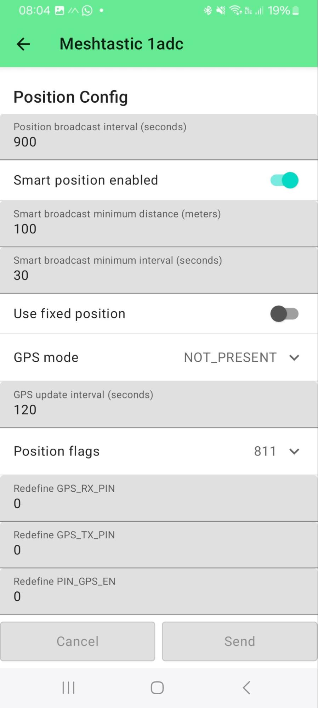

Nesta tela, é possível ligar/desligar o GPS (caso a placa possua).
É também possível configurar uma posição fixa (recomendado para nós fixos).

---

#### Configuração da Rede LoRa

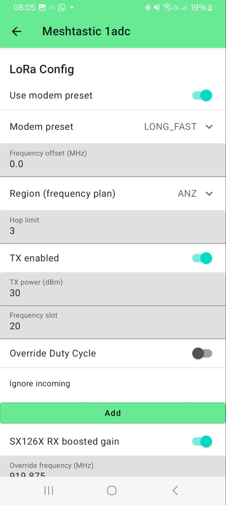

Nesta tela, é possível aumentar a opção *Hop Limit* para `7` se estiver em uma região com poucos nós para aumentar a cobertura.

---

#### Configuração da Rede Wi-Fi

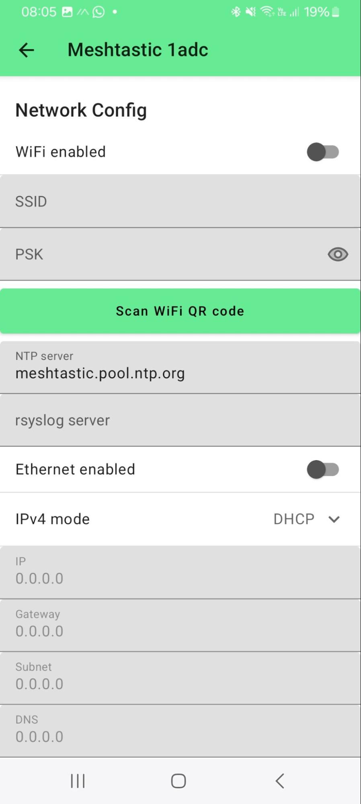

**Como assim? O *Meshtastic* não era uma alternativa às operadoras de comunicação?**

Calma! Se quiser, você pode conectar o dispositivo a uma rede Wi-Fi para 1) acessá-lo via rede Wi-Fi ou 2) usar um servidor MQTT para receber mensagens de outras regiões.

---

#### Configuração do MQTT

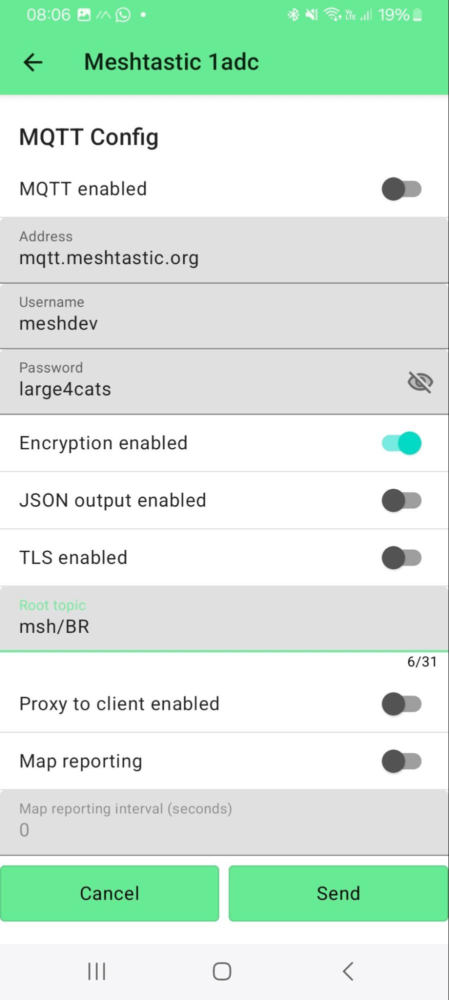

Caso um nó esteja conectado a uma rede Wi-Fi com acesso à internet, é possível configurar um servidor MQTT para que seja possível enviar e receber mensagens através da internet e, desta forma, aumentar a cobertura da rede mesh LoRa.

---

#### Configuração do MQTT

O próprio projeto *Meshtastic* mantém um servidor MQTT que já vem pré-configurado. Se for usá-lo, não se esqueça de alterar a opção *Root topic* para `msh/BR`.

---

#### Configuração do MQTT

Considerações sobre o uso do servidor MQTT:
- A rede mesh LoRa tem alcance limitado e usar um servidor MQTT permite, por exemplo, interligar diferentes cidades;
- Qualquer mensagem trafegada pela rede pode ser enviada ao servidor MQTT se um nó configurado recebê-la (sim, é possível um nó definir que não quer que sua mensagem seja encaminhada ao servidor MQTT);
- Da mesma forma, é possível acessar as mensagens (criptografadas) enviadas ao servidor MQTT pela internet, o que torna a integração do Meshtastic com outros sistemas mais *fácil*;

---

### Mas o Meshtastic só envia e recebe mensagens? :envelope:

Não!

O *Meshtastic* permite, entre outras funcionalidades, controlar hardwares remotamente (automação), atuar como *tracker* (um nó que reporta sua posição), agregar sensores de presença, luminosidade, temperatura, qualidade do ar etc...

---

#### Por exemplo: Módulo Serial

<iframe src="https://meshtastic.org/docs/configuration/module/serial/" height="80%" width="100%" frameBorder="1"></iframe>

---

### Mas é tudo grátis, mesmo? :thinking:

Sim, mas...

#### O Meshtastic depende de você!

Cada nó (rádio) faz parte da rede, então garanta que seus nós estejam ativos e funcionando para aumentar a cobertura da rede mesh LoRa.

Considere montar nós estáticos e montá-lo em locais "estratégicos"

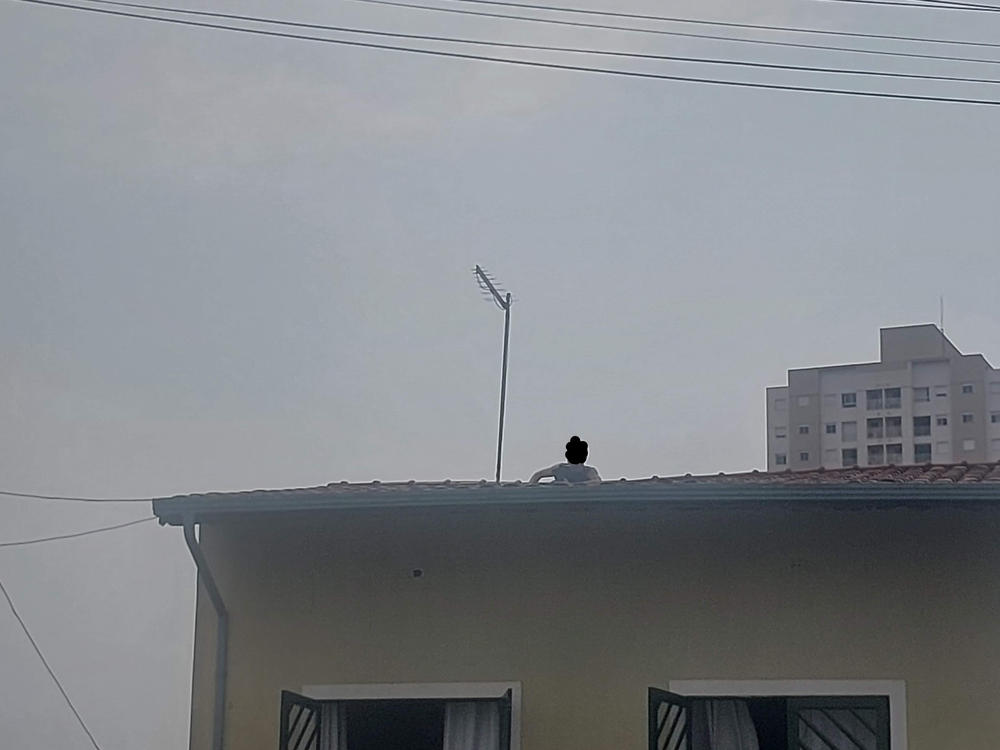

---

#### Por exemplo: Nó Solar do LHC!

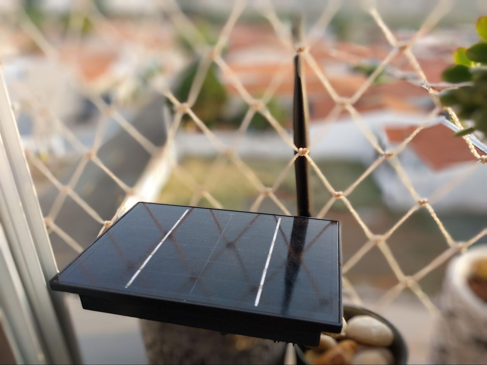

---

#### Por exemplo: Nó Solar do LHC!

Observem a curva de carga da bateria do nó solar e também o *Uptime* do nó!

Este nó é ideal para ser posicionado em locais altos mas que não possuem energia elétrica (caixas d'água, prédios abandonados etc)

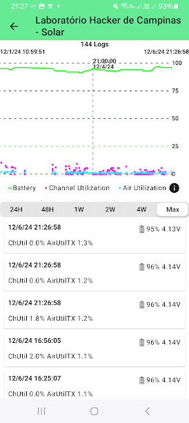
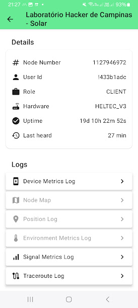

---

#### Dica: Economize Energia :battery:

Ative o modo de economia de energia. Não se preocupe, o rádio LoRa sempre fica ligado e, quando receber uma mensagem, irá ligar o ESP32.

O modo *low-power* é imprescindível para nós solares e vai render muito mais horas para nós com bateria.

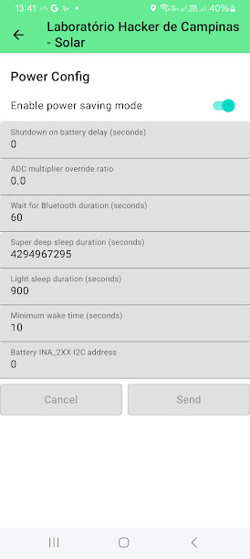

---

## Referências Gerais

- **Tópico no Discourse do LHC**: https://discourse.lhc.net.br/t/rede-mesh-com-lora-meshtastic/
- Documentação oficial do Meshtastic: https://meshtastic.org/docs/
- Artigo "Meshtastic: Rede de Comunicação Mesh LoRa Aberta e Livre": https://embarcados.com.br/meshtastic-rede-de-comunicacao-mesh-lora-aberta-e-livre/
- Canal oficial do Meshtastic no Youtube: https://www.youtube.com/@Meshtastic
- Meshtastic Brasil (comunidade não-oficial): https://www.meshbrasil.com/
  - Grupo do Telegram da comunidade: https://t.me/meshtastic_br
